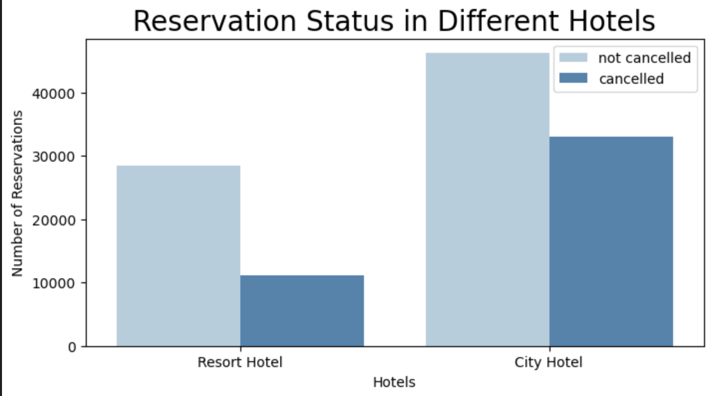
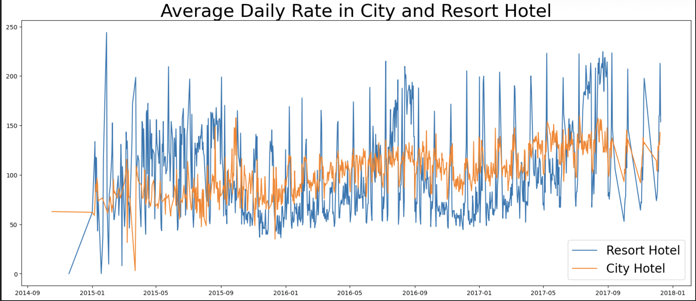
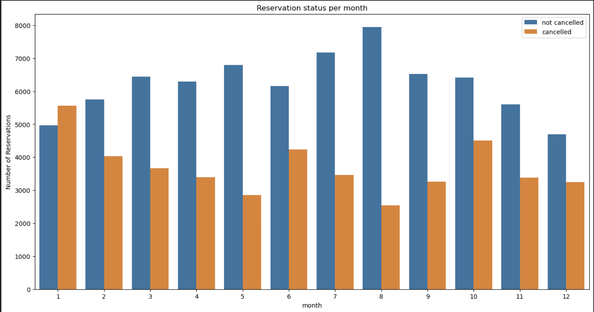
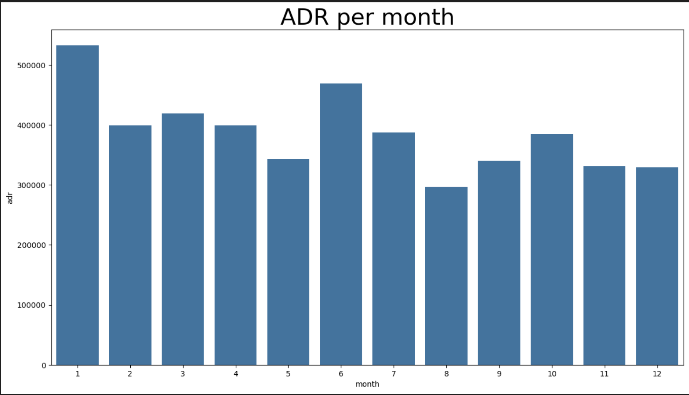
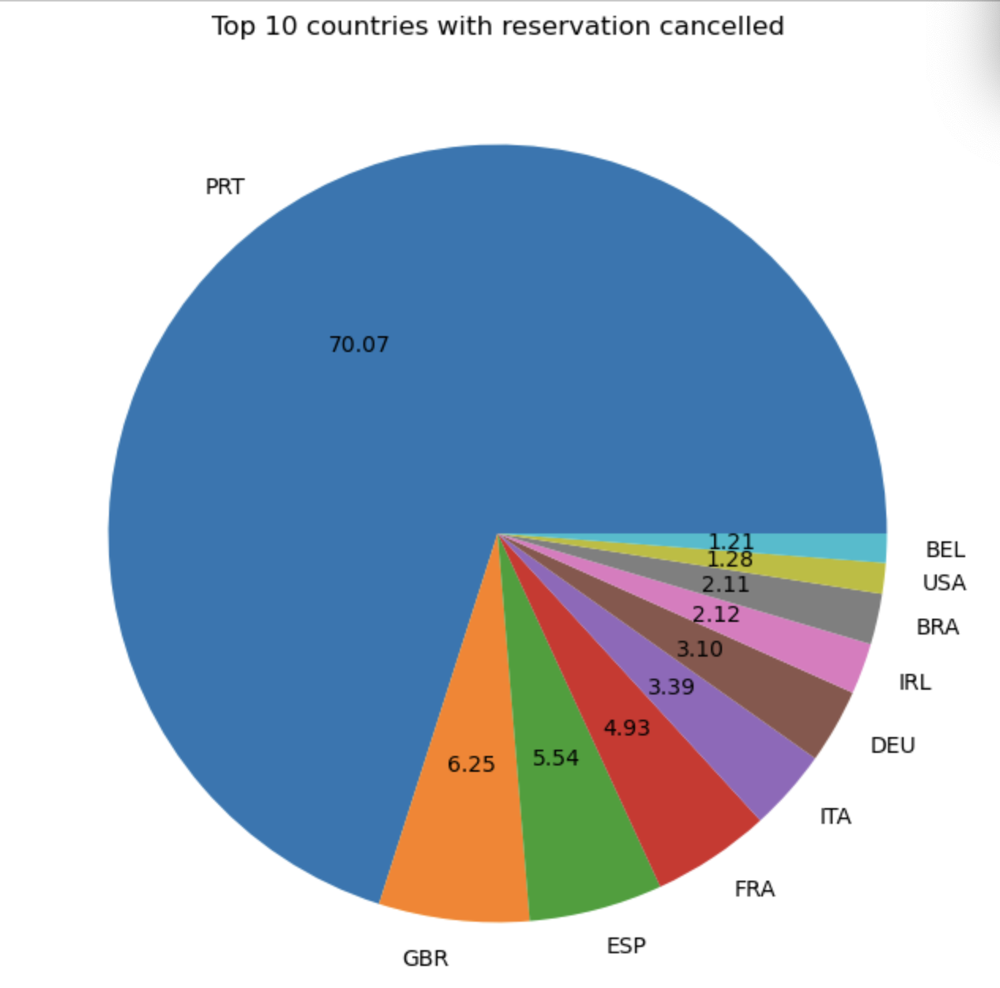
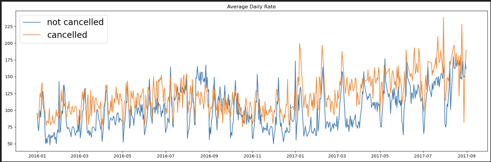

# Business Problem

In recent years, **City Hotel** and **Resort Hotel** have seen high cancellation rates. Each hotel is now dealing with several issues as a result, including fewer revenues and less-than-ideal hotel room use. Consequently, lowering cancellation rates is both hotels' primary goal in order to increase their efficiency in generating revenue, and for us to offer thorough business advice to address this problem.

The analysis of hotel booking cancellations, as well as other factors that have no bearing on their business and yearly revenue generation, are the main topics of this report.

---

## Assumptions

- No unusual occurrences between 2015 and 2017 will have a substantial impact on the data used.  
- The information is still current and can be used to analyze a hotel's possible plans in an efficient manner.  
- There are no unanticipated negatives to the hotel employing any advised technique.  
- The hotels are not currently using any of the suggested solutions.  
- The biggest factor affecting the effectiveness of earning income is booking cancellations.  
- Cancellations result in vacant rooms for the booked length of time.  
- Clients make hotel reservations the same year they make cancellations.

---

## Research Questions

- What are the variables that affect hotel reservation cancellations?  
- How can we make hotel reservation cancellations better?  
- How will hotels be assisted in making pricing and promotional decisions?

---

## Hypotheses

- More cancellations occur when prices are higher.  
- When there is a longer waiting list, customers tend to cancel more frequently.  
- The majority of clients are coming from offline travel agents to make their reservations.

---

## Analysis and Findings

- 

  The bar graph shows the percentage of reservations that are cancelled and those that are not. **37% of clients cancelled** their reservation, significantly impacting hotel earnings.

- 

  In comparison to resort hotels, city hotels have more bookings. This may be due to resort hotels being more expensive.

- 

  On certain days, the **average daily rate (ADR)** for city hotels is less than that of resort hotels. Weekends and holidays may cause resort hotel rates to spike.

- 

  A grouped bar graph shows **August** has the highest number of both confirmed and cancelled reservations, while **January** has the highest cancellation rate alone.

- 

  This graph shows cancellations are most common when prices are highest, confirming **price is a major driver** of cancellations.

  **Portugal** tops the chart for most cancelled reservations.

- 

  - 46%: Online Travel Agencies (OTA)  
  - 27%: Groups  
  - 4%: Direct Bookings

- 

  ADR is higher for cancelled reservations, which supports earlier findings.

---

## Suggestions

- Hotels should review **pricing strategies** to reduce cancellations. Offering **targeted discounts** based on location may help.

- Since resort hotels see **higher cancellation ratios**, especially on weekends and holidays, they should offer **special pricing or packages** during those periods.

- For **January**, launch **discount or loyalty campaigns** to reduce cancellations and improve occupancy.

- Focus on improving **service and quality** in **Portugal**, the region with the highest cancellation rate.
